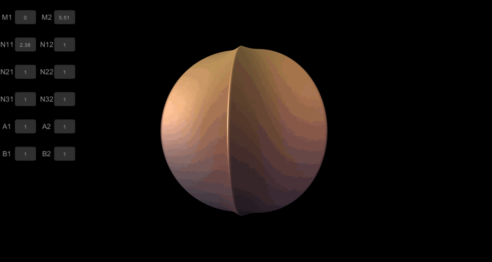

Superformula Mesh Generator Unity

Fast real-time reconstruction of a 3D mesh from Superformula in Unity.
https://en.wikipedia.org/wiki/Superformula
http://paulbourke.net/geometry/supershape/

This repo includes a GPU (direct compute) implementation, with mesh generation and on the fly calculation of normals and tangents happening in a compute shader. The mesh is then rendered using unity's drawprocedural method, reading fresh computed data directly from compute buffers.  With this approach data never get back to the CPU in the whole process.

Fix Errors:
- fix normals on seam and poles.